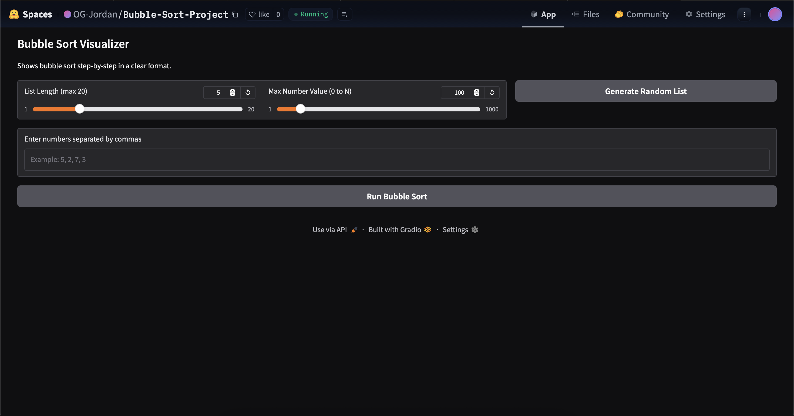
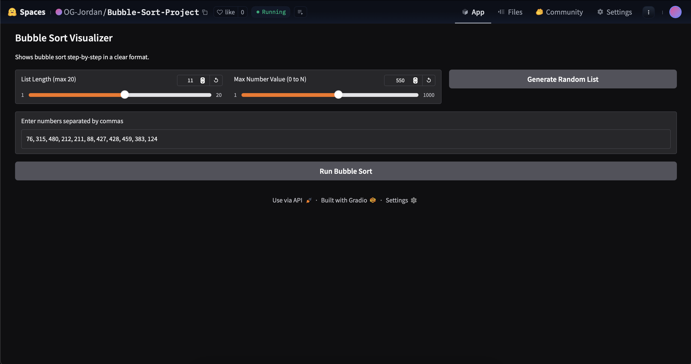
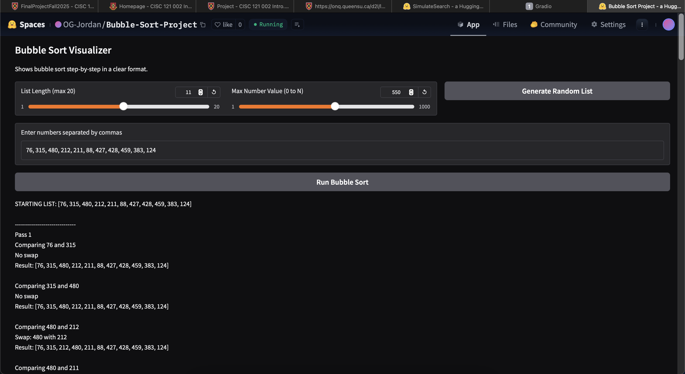
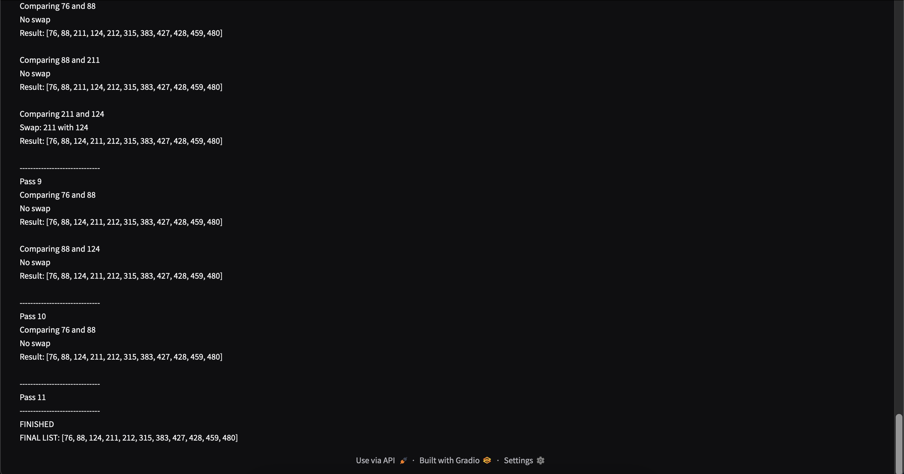
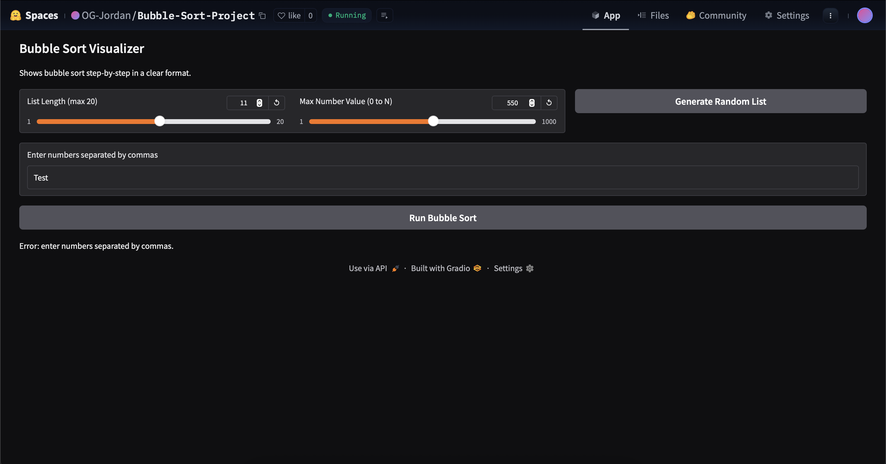
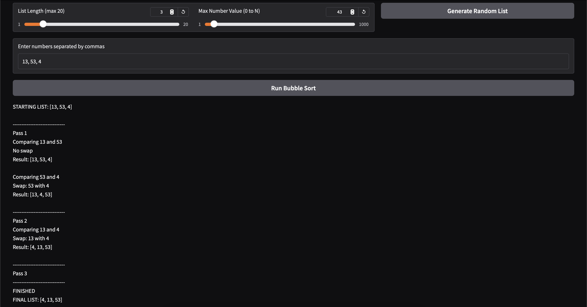
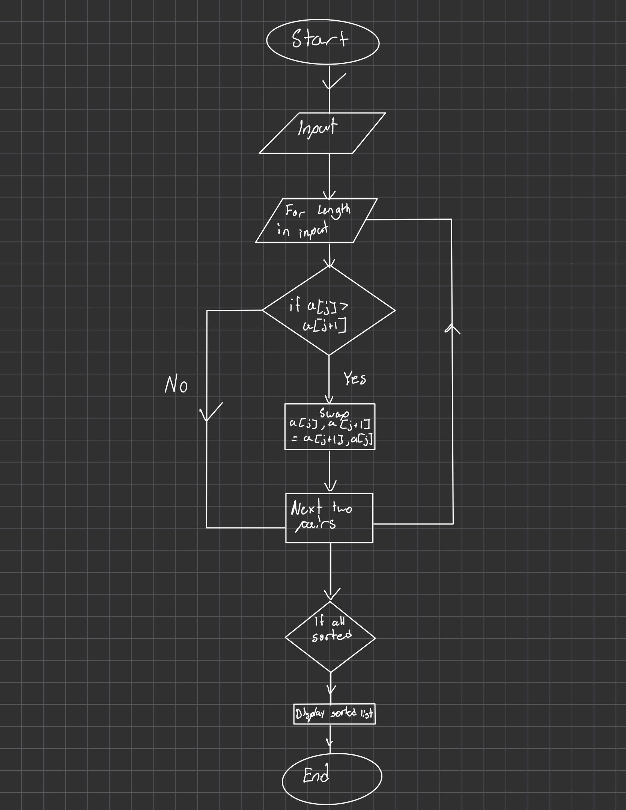

Bubble Sort

I chose do create my app using the Bubble Sort Algorithm because to me, it was the easiest to code and the one I understand the most out of all the sorting and searching method.

## Demo video/gif/screenshot of test
 When page loads up
 Showing the working slide bars and 'Generate Random List' button
 Showing the 'Run Bubble Sort' button working
 Showing the steps and finished bubble sort list
 Showing the error message if the input is not a list of numbers typed in correctly
 An example of everything working

## Problem Breakdown & Computational Thinking
Decomposition - The program should start by takeing the inputed list of numbers. It then takes that list and goes throught he bubble sorrt algorithm. The algorthims works by going through the list mutiple times. Each time it compares two numbers next to eachother and displays which two numbers that are being compared. If the number in front is larger, it should swap and display if it swaps or not and display the new list with the swapped numbers. This should continue until the whole list is sorted from smallest number to largest number. When done, it should display finish and display the sorted list.

Pattern Recognition - The pattern is the Bubble sort algorithm. Bubble sort works by comparing two numbers beside eachother and checks if the number in front is larger or not. If it is, the numbers will swap places, then continur to the mext pair. If not continue to the next pair. This pattern keeps on running through the list until the list is sorted.

Abstraction - The user sees the starting list, each comparison, each swap that happens, and the final sorted list. The program does not show extra details like loop numbers an

Algorithm - The user enters the numbers as a string into the Gradio textbox. The program converts it into a list of integers and sorts it using the bubble sort while recording each step. The steps are combined into a multi-line string and shown in another textbox on the GUI, giving a visualization of the sorting process.

Input datatpyr: String
Internal datatype: Integers
Output datatpye: String

Flowchart in:

## Steps to Run
1. Open the link
2. input your own sets of number using commas to serperate each numbers or use the the scroll bar to choose the length of the the list (1-20) and the the max value (1-1000). Then click Genrate Random List to generate the list.
3. Then click Run Bubble sort to display the steps of the bubble sort algorithm on the list of numbers and the finished sorted list.

## Hugging Face Link
https://huggingface.co/spaces/OG-Jordan/Bubble-Sort-Project
## Author & Acknowledgment
